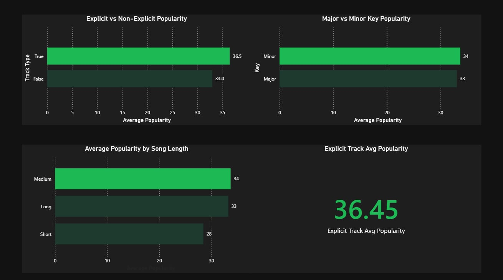
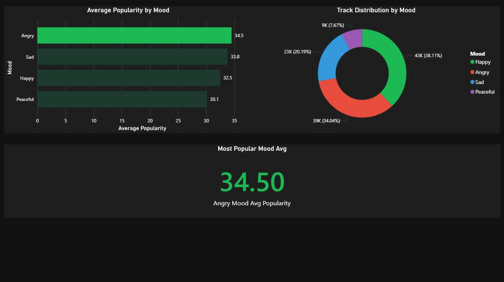
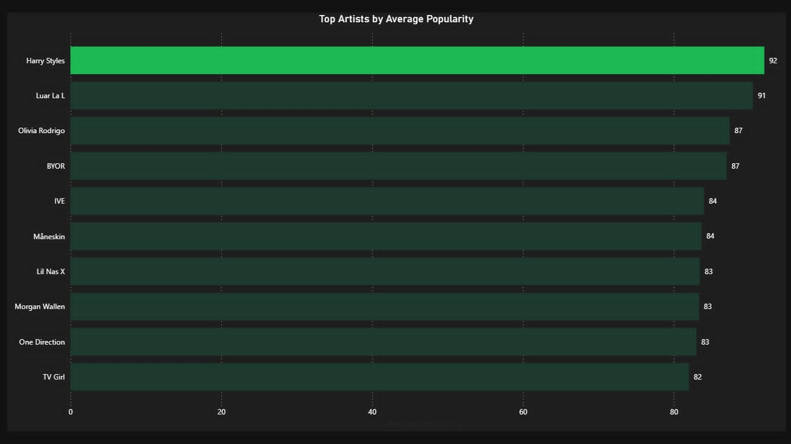
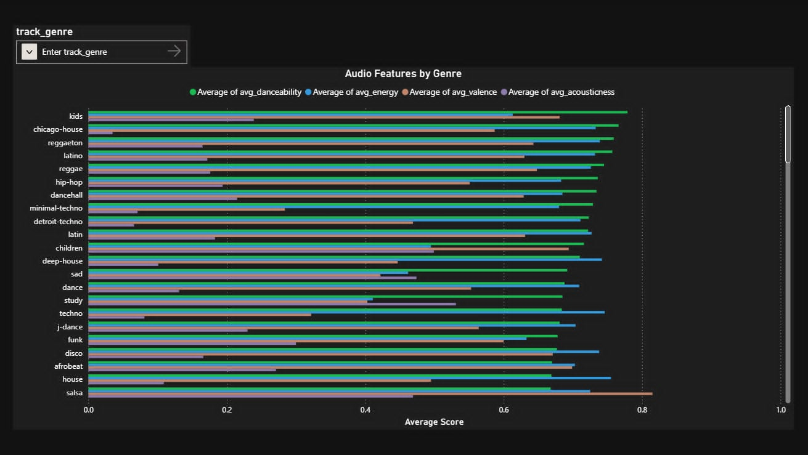
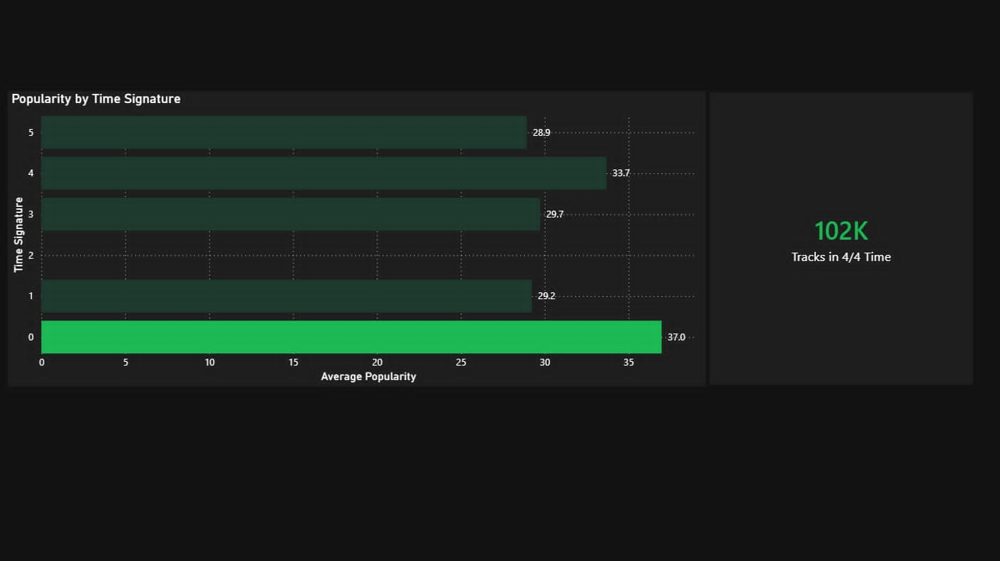

# Azure Spotify Data Pipeline

An end-to-end data engineering portfolio project that ingests, transforms, and visualizes Spotify music data using a medallion lakehouse architecture on Azure.

## Architecture
```
ADF → ADLS Gen2 → Databricks → Synapse Analytics → dbt Core → Power BI → Airflow
```

## Tech Stack
| Layer | Tool |
|---|---|
| Ingestion | Azure Data Factory |
| Storage | Azure Data Lake Storage Gen2 |
| Transformation | Databricks (PySpark) |
| Serving | Azure Synapse Analytics (Serverless) |
| Modeling | dbt Core (dbt-synapse) |
| Visualization | Power BI |
| Orchestration | Apache Airflow (Astro CLI) |

## Pipeline Stages
- **Bronze** → 114 Spotify genre CSVs ingested via ADF dynamic pipeline (Lookup → ForEach → Copy)
- **Silver** → 113,865 clean rows in Delta format via Databricks PySpark
- **Gold** → 7 analytical Parquet tables via Databricks
- **dbt** → 7 Synapse views with 13 data quality tests (all passing)
- **Airflow** → Full pipeline orchestrated in a single DAG (4 tasks, manually triggered)

## Airflow DAG
```
silver_transformation → gold_transformation → dbt run → dbt test
```
Each task only runs if the previous one succeeds. No schedule — triggered manually since the dataset is static.

## Key Engineering Decisions
- **Dynamic ADF pipeline** — used a JSON lookup file to drive 114 copy operations from a single pipeline instead of hardcoding each CSV
- **dbt Core over dbt Cloud** — dbt Cloud API is blocked on the free tier; switched to running dbt Core directly inside the Airflow Docker container via BashOperator
- **Azure Service Principal auth** — used client ID, tenant ID, and client secret to authenticate dbt Core to Synapse Analytics, stored as Docker environment variables

## Dashboard Preview

### Popularity Analysis

Explicit tracks score higher in average popularity (36.5) vs non-explicit (33.0), and minor key songs slightly edge out major key tracks.

### Mood Analysis

Angry mood tracks lead in average popularity (34.5) despite Happy mood dominating track count (38.11% of all tracks).

### Artist Leaderboard

Harry Styles ranks #1 with an average popularity of 92, followed closely by Luar La L (91) and Olivia Rodrigo (87).

### Genre Audio DNA

Kids and Chicago House genres show the highest danceability scores, while Techno and Detroit Techno lead in energy.

### Time Signature Analysis

102K tracks use 4/4 time signature, the most common in music. Tracks with an unclassified time signature (0) surprisingly show the highest average popularity at 37.0.

## How to Run
1. Clone the repo
2. Copy `airflow/.env.example` to `airflow/.env` and fill in Azure credentials
3. Run `astro dev start` inside `airflow/`
4. Trigger `spotify_pipeline` DAG in Airflow UI at `http://airflow.localhost:6563`

## Project Structure
```
azure-spotify-pipeline/
├── adf/                        # ADF pipeline JSON (git.json)
├── airflow/                    # Astro CLI project
│   ├── dags/
│   │   ├── dbt/                # dbt Core copy (used by Airflow container)
│   │   └── spotify_pipeline.py # Main DAG
│   ├── Dockerfile
│   ├── requirements.txt
│   └── packages.txt
├── data/                       # Sample Spotify CSVs
├── databricks/                 # PySpark notebooks
├── dbt/                        # dbt Core project (source of truth)
│   ├── models/
│   ├── macros/
│   ├── seeds/
│   ├── snapshots/
│   ├── tests/
│   └── dbt_project.yml
├── .gitignore
└── README.md
```

> **Note:** `dbt/` at the root is the source of truth for all dbt models. A copy lives inside `airflow/dags/dbt/` so dbt Core can execute inside the Airflow Docker container.